# MEAN STACK DEPLOYMENT TO UBUNTU IN AWS

## MEAN Stack is a combination of following components:
1. **MongoDB** (Document database) – Stores and allows to retrieve data.
2. **Express** (Back-end application framework) – Makes requests to Database for Reads and Writes.
3. **Angular** (Front-end application framework) – Handles Client and Server Requests
4. **Node.js** (JavaScript runtime environment) – Accepts requests and displays results to end user.

### First, we need to do these steps:
1. Create an account on [AWS](https://aws.amazon.com/)
2. Create an instance (virtual machine) by selecting “ubuntu server 20.04 LTS” from Amazon Machine Image(AMI)(free tier).
3. Select “t2.micro(free tier eligible)” and select you Key Pair
4. On the security group and select “existing security group” review and click Launch Instance.

#### This launches the instance and takes you to the Instances dashboard
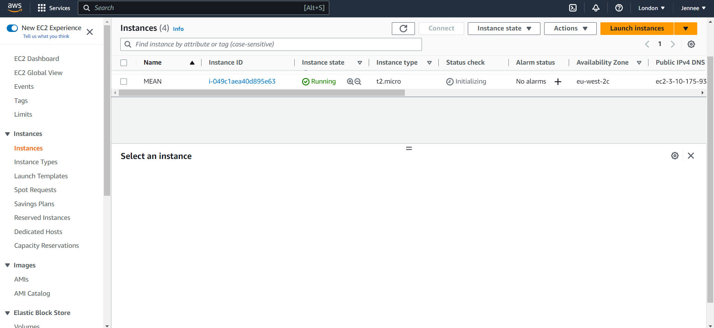

5. Then open a terminal on your system and enter the folder where your previously downloaded PEM file is located.

#### ***In this case we use the Git Bash Terminal***

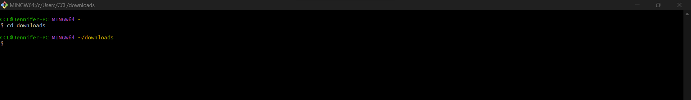

6. Connect to the instance from ubuntu terminal using this command:

>`ssh -i "Jennee-EC2.pem" ubuntu@ec2-35-176-8-236.eu-west-2.compute.amazonaws.com`
###### ***Use your own***

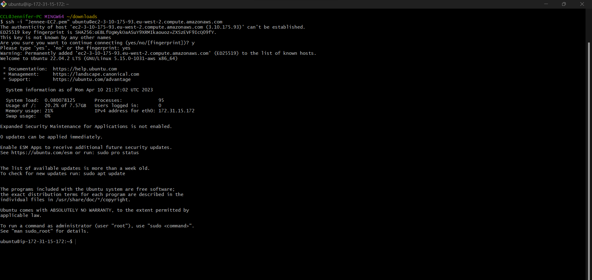

#### *This automatically connects to the instance when you click Enter*
<br>

###  INSTALLING NODEJS

#### *Node.js is a JavaScript runtime built on Chrome’s V8 JavaScript engine. Node.js is used in this tutorial to set up the Express routes and AngularJS controllers.*

<br>

### First, we Update ubuntu using this command:
>`sudo apt update`

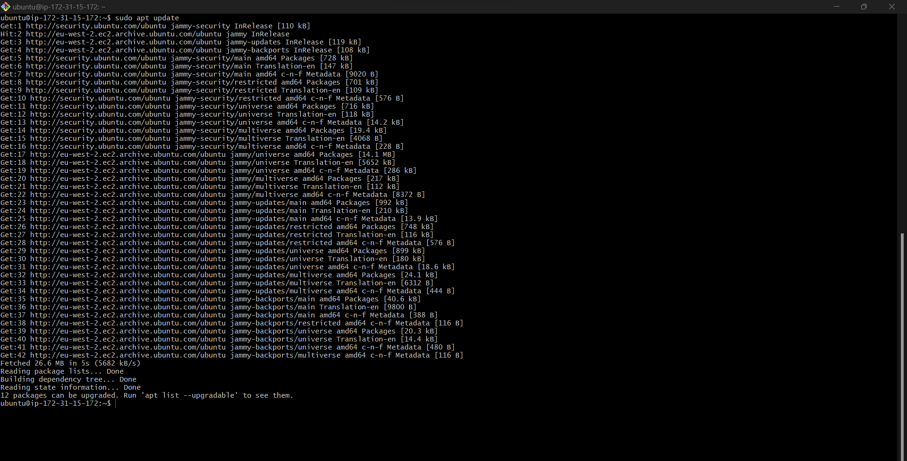

### Then Upgrade ubuntu using this command:
>`sudo apt upgrade`

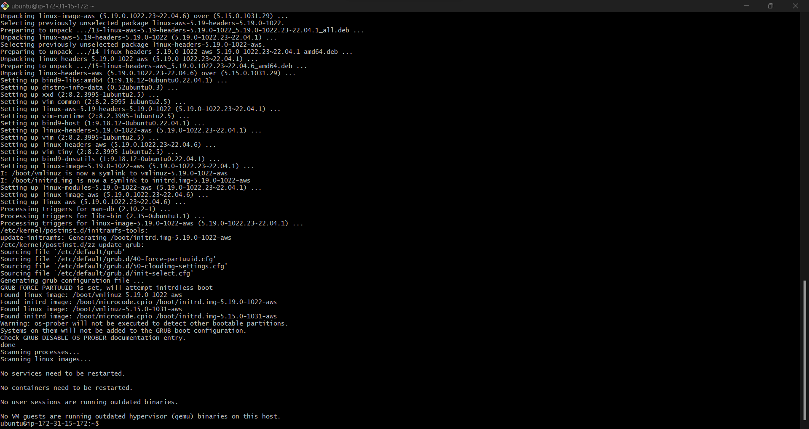

### Then we Add certificates, using this command:

```
sudo apt -y install curl dirmngr apt-transport-https lsb-release ca-certificates

curl -sL https://deb.nodesource.com/setup_12.x | sudo -E bash -
```

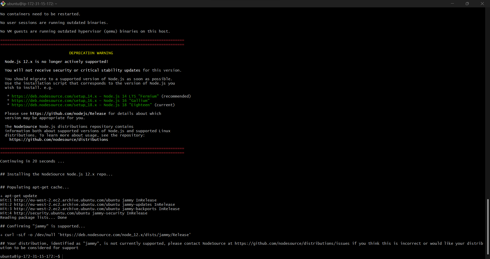

### Next, Install NodeJS, using this command:
>`sudo apt install -y nodejs`

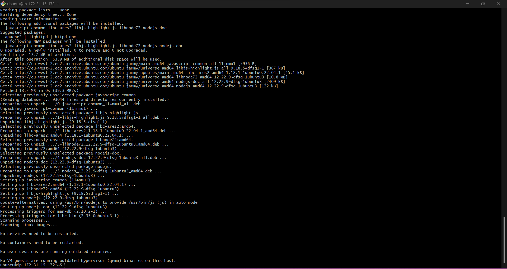

<br>

### INSTALLING MONGODB

### *MongoDB stores data in flexible, JSON-like documents. Fields in a database can vary from document to document and data structure can be changed over time.*

#### Here, we are adding book records to MongoDB that contain book name, isbn number, author, and number of pages. With these commands:
<br>

```
 sudo apt-key adv --keyserver hkp://keyserver.ubuntu.com:80 --recv 0C49F3730359A14518585931BC711F9BA15703C6
 ```
 ```
echo "deb [ arch=amd64 ] https://repo.mongodb.org/apt/ubuntu trusty/mongodb-org/3.4 multiverse" | sudo tee /etc/apt/sources.list.d/mongodb-org-3.4.list
```

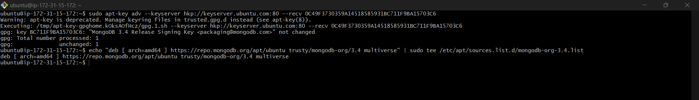

### Install MongoDB using this command:
>`sudo apt install -y mongodb

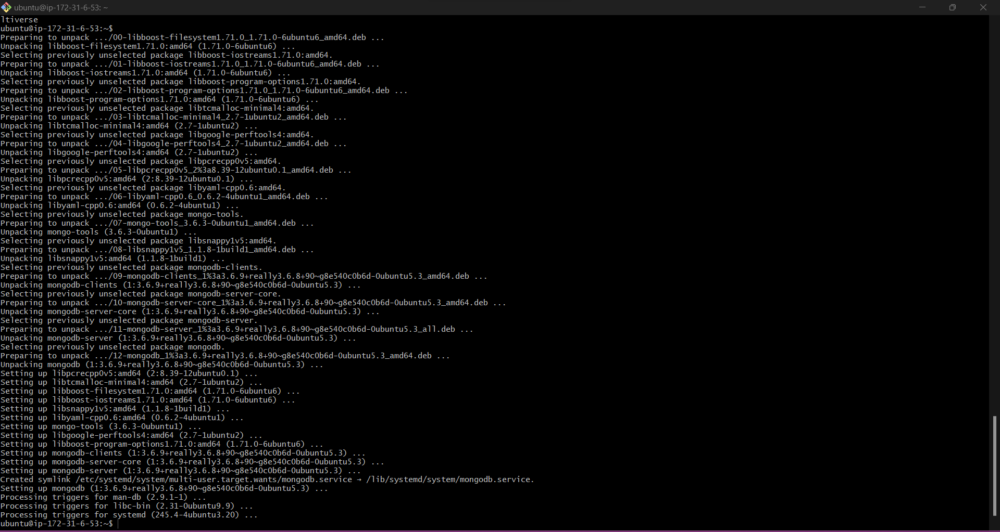

### Then, we Start the server with this command:
>`sudo service mongodb start`

#### To verify that the server is up and running, we run the command:
>`
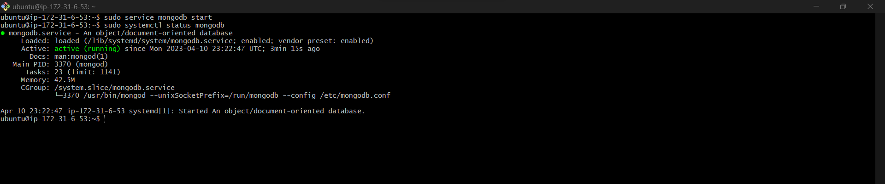

### Next, we Install **npm** – Node package manager, using this command:
>`sudo apt install -y npm`

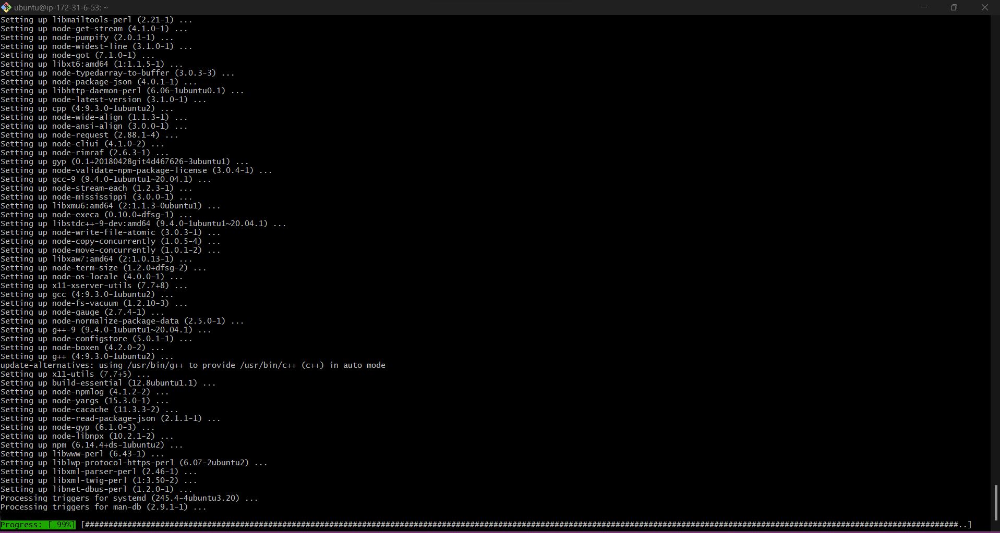

### After that, we Install **body-parser** package, using this command:
>`sudo npm install body-parser`

##### *The **‘body-parser’** package is used to process JSON files passed in requests to the server.*

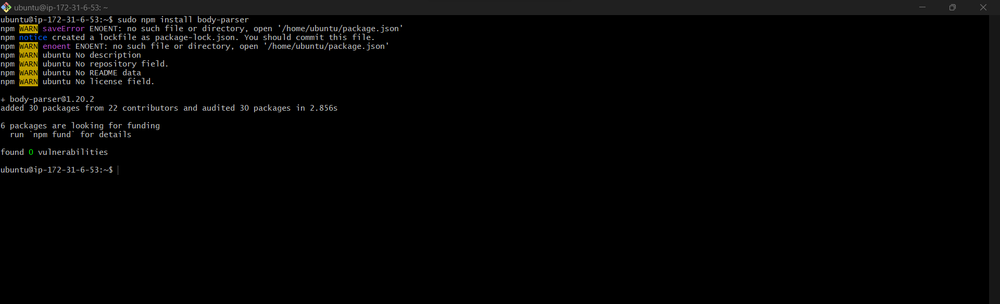

### Next, we create a folder named **Books**, using this command:
>` mkdir Books && cd Books`

#### In the Books directory, Initialize npm project, using this command:
>`npm init`

###### *Hit the **Enter** button on your keyboard until you get the prompt "Is this OK? (yes), type 'yes' and hit **Enter***

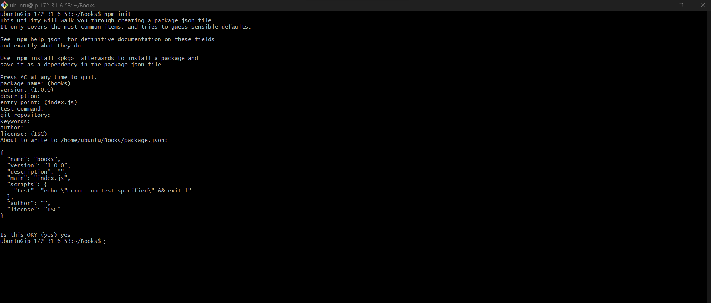

### Next, Add a file to the **Books** named ***server.js***, using this command:
>` touch server.js`

#### Then open the file using this command:
>`vi server.js`

#### And paste the following web server code below into the ***server.js*** file:

```
var express = require('express');
var bodyParser = require('body-parser');
var app = express();
app.use(express.static(__dirname + '/public'));
app.use(bodyParser.json());
require('./apps/routes')(app);
app.set('port', 3300);
app.listen(app.get('port'), function() {
    console.log('Server up: http://localhost:' + app.get('port'));
});
```


##### Click esc, then,
##### Save with:
>`:w`

##### Exit with:
>`:qa`

<br>

---